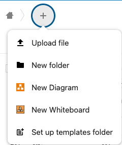
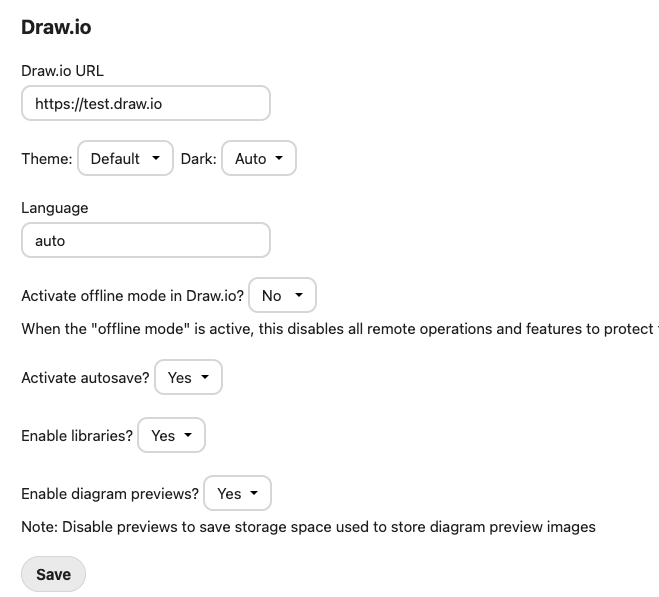

#  Nextcloud draw.io integration app

This app allows users to create and edit diagrams in [Nextcloud](https://nextcloud.com) using [draw.io](https://app.diagrams.net). Note that draw.io is NOT open source software.

App Store link: https://apps.nextcloud.com/apps/drawio

Once installed, you will see an option to create a Draw.io diagram/whiteboard from the 'create file' menu.  Note: this app does not produce an app icon.

## Info ##
- Requires [Nextcloud](https://nextcloud.com) >=20.0.0
- Version 20.8.6+ of draw.io is required.
- Real-time collaboration only works with the official online version of draw.io (https://embed.diagrams.net) and Autosave enabled in draw.io settings (/index.php/settings/admin/drawio).
- Multi language support (l10n)
- Inspired by the old Draw.io Integration and OnlyOffice
- Tested with Chrome 58-96 and Firefox 53-89
- Tested with PHP 5.6/7.1/7.3/8.0/8.1
- Draw.io Integration tested with NextCloud 20.0.0 / 21.0.0 / 22.0.0 / 23.0.0 / 24.0.1 / v25.0.1 / v26.0.0 / v27.0.0
  
## Download ##

[Our Github releases page](https://github.com/jgraph/drawio-nextcloud/releases)

## Changelog ##

[Changelog](https://github.com/jgraph/drawio-nextcloud/blob/release/CHANGELOG.md)

## Installation ##
1. Copy Nextcloud draw.io integration app ("drawio" directory) to your Nextcloud server into the /apps/ directory
2. Go to "Apps" > "+ Apps" > "Not Enabled" and _Enable_ the **Draw.io** application
3. Go to "Admin settings > Draw.io" ( /index.php/settings/admin/drawio ) and click the "Save" button to register MIME types.

## Real-time collaboration ##

Realtime collaboration is only possible with **Autosave enabled** and using the official diagrams.net server (https://embed.diagrams.net). Self hosted servers won't work.

## Known Issues ##
- If you're experiencing problems while updating your Nextcloud intance, try to disable/delete draw.io integration app (/apps/drawio/) and then install/copy it again after the NC update is completed.
- Clear PHP cache after updating the app if you have undefined method/classes errors. For example, if you're using PHP-FPM, you can restart the service `service php7.4-fpm restart`.
- Integrity check of Nextcloud core fails as we add our new MIME types and icons. This is expected and safe to ignore ([issue #26](https://github.com/jgraph/drawio-nextcloud/issues/26)).

## Configuration ##
Go to Admin page and change the settings you want:

Click "Save" when you're done.

If you would like to self-host draw.io, you might want to consider https://github.com/jgraph/docker-drawio (requires version 20.8.6+).

## SOC 2 ##

This repo is not covered by the JGraph SOC 2 process.
